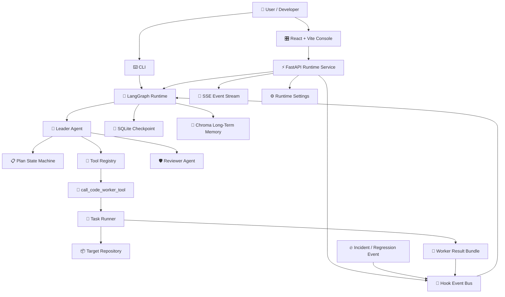
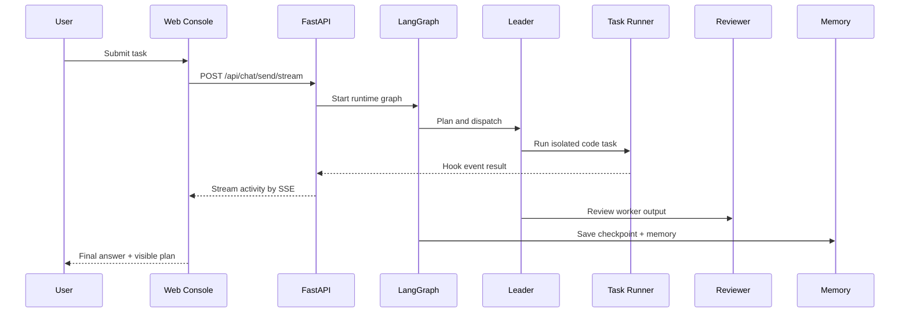
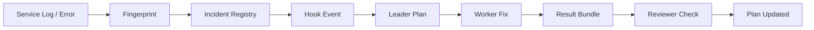

<div align="center">


[](https://git.io/typing-svg)

<p>
  <a href="./README.md">简体中文</a>
  ·
  <a href="./README.en.md">English</a>
  ·
  <a href="./docs/api.en.md">API Docs</a>
  ·
  <a href="./CONTRIBUTING.en.md">Contributing</a>
</p>

<p>
  
  
  
  
  
  
</p>

<h3>From a chat bot to an observable, resumable, event-driven software engineering runtime.</h3>

</div>

---

## 🚀 Overview

`code-terminator` is a multi-agent runtime for real software engineering workflows. It is not a toy chat demo. It is built around a practical engineering loop:

```text
detect problem -> plan work -> dispatch worker -> collect result -> review output -> resume when needed
```

The project connects **LangGraph orchestration**, **FastAPI streaming APIs**, **React control console**, **Docker-isolated code workers**, **long-term memory**, **incident wakeup**, and **GitHub-native automation** into one runtime.

---

## ✨ Core Capabilities

| Module | Capability | Engineering Value |
| --- | --- | --- |
| 🧠 Leader Agent | Decomposes goals, maintains plans, calls tools | Turns one-shot chat into a stateful task machine |
| 🛠️ Worker Agent | Executes concrete code tasks | Handles implementation and repository-level work |
| 🛡️ Reviewer Agent | Reviews results and checks quality | Keeps the loop from blindly accepting generated output |
| 🌊 SSE Streaming | Streams runtime events to the web UI | Makes planning, logs, and results visible in real time |
| 🧩 Plan State Machine | Tracks pending / running / done items | Provides observable and recoverable progress |
| 🐳 Isolated Execution | Runs worker jobs in containers | Isolates repository tasks from the host workspace |
| 🧬 Memory + Checkpoint | SQLite checkpoint + Chroma memory | Supports recovery, long context, and historical reuse |
| 🔔 Incident Wakeup | Converts incidents into repair work | Moves from passive chat to event-driven repair |
| 🔀 GitHub Flow | Token injection, PR fallback, automation hooks | Connects agent output with real collaboration workflows |
| ⚙️ Runtime Settings | Persists settings through UI/API | Allows runtime configuration without manual restarts |

---

## 🌌 Capability Landscape

<table>
  <tr>
    <td width="50%">
      <h3>🧠 Agentic Runtime</h3>
      <p>The Leader interprets goals, decomposes tasks, maintains plan items, invokes tools, and consumes runtime events. Worker and Reviewer agents complete the execution loop.</p>
    </td>
    <td width="50%">
      <h3>🌊 Observable Workflow</h3>
      <p>FastAPI + SSE streams conversations, plans, activity logs, and results into the React console. The runtime is designed to be watched while it works.</p>
    </td>
  </tr>
  <tr>
    <td width="50%">
      <h3>🐳 Isolated Execution</h3>
      <p>Worker tasks are packaged into job bundles and can run inside Docker. Inputs, outputs, stdout, stderr, and structured results are persisted for replay and debugging.</p>
    </td>
    <td width="50%">
      <h3>🔥 Incident-Driven Repair</h3>
      <p>The system accepts incident_new and incident_regressed events. An incident can wake the Leader, create a repair plan, and dispatch a Worker.</p>
    </td>
  </tr>
  <tr>
    <td width="50%">
      <h3>🧬 Memory & Resume</h3>
      <p>SQLite checkpoints preserve runtime state, Chroma stores long-term memory, and runtime-state keeps conversations, plans, and settings.</p>
    </td>
    <td width="50%">
      <h3>🔀 GitHub-Native Automation</h3>
      <p>Runtime settings can persist a GitHub token and inject it into Worker jobs as GITHUB_TOKEN / GH_TOKEN for branch, commit, and PR workflows.</p>
    </td>
  </tr>
</table>

---

## 🏗️ Architecture



---

## 🧪 Execution Flow

> Open the web console, submit an engineering task, watch the Leader create a plan, let Workers execute isolated code jobs, stream progress through SSE, persist the state, and let the Reviewer inspect the output. If an incident event arrives, the same runtime can wake up and start a repair chain.



---

## 🧰 Tech Stack

| Layer | Stack |
| --- | --- |
| Agent Runtime | LangGraph, LangChain, OpenAI-compatible APIs |
| Backend | FastAPI, Pydantic, Uvicorn, SSE |
| Frontend | React, Vite, TypeScript |
| Worker | Docker, Codex-compatible CLI worker, isolated job bundle |
| Memory | SQLite checkpoint, Chroma long-term memory |
| Automation | GitHub token injection, hook event bus, runtime settings |
| Quality | pytest, black, isort, mypy |

---

## ⚡ Quick Start

### 1. Requirements

- Python `3.11+`
- `uv`
- Node.js + npm
- Docker

### 2. Install Dependencies

```bash
uv sync
npm install
npm --prefix web install
```

### 3. Configure Model Access

```bash
export OPENAI_API_KEY="your-api-key"
export OPENAI_BASE_URL="https://your-openai-compatible-endpoint"
export DEFAULT_MODEL="gpt-4o-mini"
export EMBEDDING_MODEL="text-embedding-3-small"
```

### 4. Start Full Stack Dev

```bash
npm run dev
```

Default endpoints:

| Service | URL |
| --- | --- |
| Web Console | `http://127.0.0.1:5174` |
| FastAPI | `http://127.0.0.1:18000` |
| Swagger UI | `http://127.0.0.1:18000/docs` |

---

## 🖥️ Run Modes

### CLI

```bash
uv run python -m src.main --task "Build a TODO app backend"
```

Use a thread ID for recovery:

```bash
uv run python -m src.main \
  --task "Build a TODO app backend" \
  --thread-id demo-001
```

Resume a previous run:

```bash
uv run python -m src.main \
  --task "resume" \
  --thread-id demo-001 \
  --resume
```

### API

```bash
uv run uvicorn src.api.app:app --reload --host 127.0.0.1 --port 18000
```

Common endpoints:

| Endpoint | Description |
| --- | --- |
| `GET /api/health` | Health check |
| `GET /api/agents/status` | Agent status |
| `POST /api/chat/send` | Non-streaming task |
| `POST /api/chat/send/stream` | SSE streaming task |
| `GET /api/chat/history` | Chat history |
| `GET /api/conversations/{conversation_id}` | Conversation detail |
| `GET /api/conversations/{conversation_id}/plan` | Plan snapshot |
| `GET /api/settings/runtime` | Read runtime settings |
| `PUT /api/settings/runtime` | Persist runtime settings |

---

## 🎛️ Web Console

The web console is more than a chat box:

- Conversation list and history recovery
- Streaming messages
- Plan panel
- Activity log
- GitHub token settings
- SSE-driven progress updates
- Persistent conversations and plan snapshots

Run it with:

```bash
npm run dev
```

`web/vite.config.ts` proxies `/api` to the backend port. The default backend port is `18000`.

---

## 🐳 Isolated Execution Environment

Build an execution image:

```bash
docker build -t code-terminator/worker-codex -f docker/worker-codex/Dockerfile .
export CODEX_WORKER_DOCKER_IMAGE="code-terminator/worker-codex"
```

Each dispatched task is persisted as a job bundle:

```text
.code-terminator/
  worker-jobs/
    <job-id>/
      leader-task.md
      leader-task.json
      stdout.log
      stderr.log
      result.json
```

Key settings:

| Variable | Default | Description |
| --- | --- | --- |
| `CODEX_WORKER_DOCKER_IMAGE` | `mcr.microsoft.com/playwright:v1.58.2-noble` | Execution image |
| `CODEX_WORKER_TIMEOUT_SECONDS` | `1800` | Task timeout |
| `CODEX_WORKER_CONTAINER_WORKDIR` | `/workspace` | Container workdir |
| `CODEX_WORKER_CODEX_BIN` | `codex` | Command inside container |
| `CODEX_WORKER_MODEL` | empty | Model override for dispatched tasks |
| `CODEX_WORKER_JOB_ROOT` | `.code-terminator/worker-jobs` | Job bundle root |
| `CODEX_WORKER_DOCKER_ARGS` | empty | Extra args for `docker run` |

---

## 🔥 Incident Auto Dispatch

The runtime can consume incident and regression events:

1. Generate an incident fingerprint
2. Detect whether the problem is new or regressed
3. Create or update a plan item
4. Dispatch a Worker repair task
5. Receive results through hook events
6. Continue with Leader / Reviewer processing



---

## 🧪 Demo Repository

The external demo repository can be listed here after it is prepared:

```text
https://github.com/KKK985429/<your-demo-repository>
```

The demo repository should contain a reproducible target project, such as a backend service with seeded issues, tests, and validation scripts. This repository focuses on the runtime itself; target-system details can live in a dedicated demo repository.

---

## 🧠 Memory & Recovery

```text
.memory/
  checkpoints.sqlite
  chroma/

.code-terminator/
  runtime-state/
    conversations/
    plans/
    settings/runtime.json
  hook-events/
    pending/
    processing/
  worker-jobs/
```

Supported capabilities:

- persistent conversation history
- persistent plan snapshots
- checkpoint recovery
- disk-backed hook events
- persisted GitHub token and runtime settings
- Chroma long-term memory

---

## ⚙️ Configuration

### Core Runtime

| Variable | Default | Description |
| --- | --- | --- |
| `OPENAI_API_KEY` | empty | API key for LLM / embeddings |
| `OPENAI_BASE_URL` | empty | OpenAI-compatible endpoint |
| `DEFAULT_MODEL` | `gpt-4o-mini` | Default chat model |
| `EMBEDDING_MODEL` | `text-embedding-3-small` | Long-term memory embedding model |
| `MEMORY_DATA_DIR` | `.memory` | Memory root |
| `CHECKPOINT_DB_NAME` | `checkpoints.sqlite` | Checkpoint SQLite filename |
| `CHROMA_DIR_NAME` | `chroma` | Chroma directory name |

### API / Runtime State

| Variable | Default | Description |
| --- | --- | --- |
| `CODE_TERMINATOR_API_STATE_ROOT` | `.code-terminator/runtime-state` | API runtime state root |
| `CODE_TERMINATOR_HOOK_ROOT` | `.code-terminator/hook-events` | Hook event root |
| `CODE_TERMINATOR_HOOK_STALE_SECONDS` | `30` | Stale processing event threshold |

---

## 📦 Project Layout

```text
src/
  agents/              # leader / worker / reviewer
  api/                 # FastAPI routes, models, runtime service
  app/                 # graph, state, hook bus, incident, gitops, plan state machine
  datagov/             # bootstrap package
  memory/              # checkpoint + long-term memory
  observability/       # logging helpers
  prompts/             # role templates
  skills/              # role-scoped skills
  tools/               # tool registry + worker dispatch tools
web/                   # React + Vite console
docker/worker-codex/   # Worker Dockerfile
configs/               # OpenAI-compatible / Kimi integration examples
scripts/               # dev / smoke / worker / regression scripts
docs/                  # API / logging / smoke evidence
ecommerce-platform/    # local demo target, replace with external demo repo later
```

Key files:

| File | Description |
| --- | --- |
| `src/app/graph.py` | Main LangGraph runtime |
| `src/agents/leader.py` | Leader Agent |
| `src/tools/call_code_worker_tool.py` | Worker dispatch tool |
| `src/api/services/runtime_service.py` | API runtime service |
| `src/app/hook_bus.py` | Hook event bus |
| `src/app/incidents.py` | Incident handling entry |
| `src/app/auto_review_merge.py` | Auto review / merge logic |
| `web/src/App.tsx` | Web console entry |

---

## ✅ Verification

```bash
uv run pytest
```

Full tests:

```bash
uv run pytest tests/
```

Format and type checks:

```bash
uv run black --check src/datagov tests/bootstrap
uv run isort --check-only src/datagov tests/bootstrap
uv run mypy --strict src
```

Important runtime tests:

```bash
uv run pytest \
  tests/test_api_integration.py \
  tests/test_hook_pump.py \
  tests/test_worker_runtime_config.py \
  tests/test_incident_auto_dispatch.py \
  tests/test_auto_review_merge.py
```

---

## 📚 Related Docs

- [API Reference](./docs/api.en.md)
- [Logging Guide](./docs/logging.md)
- [Auto Review Server Checklist](./docs/auto-review-server-checklist.md)
- [Kimi Local Integration](./docs/kimi-local-integration.md)
- [Environment Status](./ENV_STATUS.md)
- [Contributing](./CONTRIBUTING.en.md)

---

<div align="center">


<b>Code Terminator</b> · Agentic software engineering runtime for real repositories.

</div>
