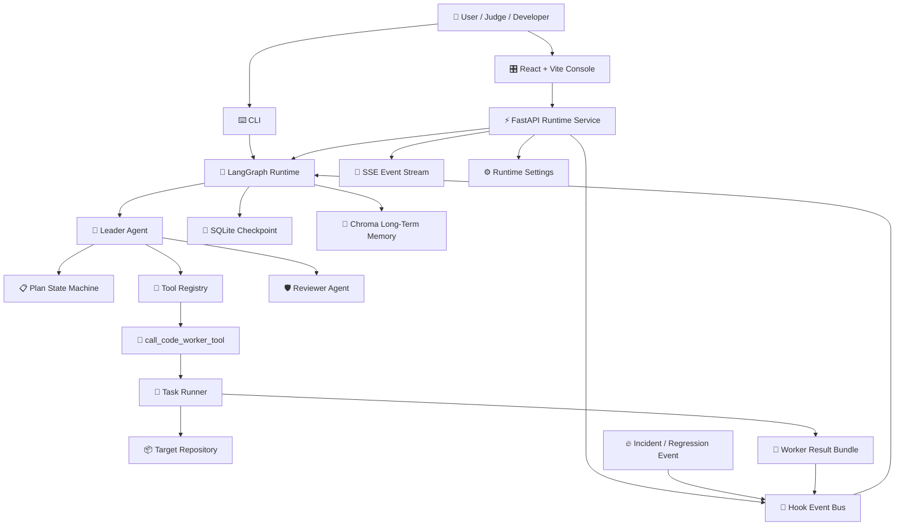
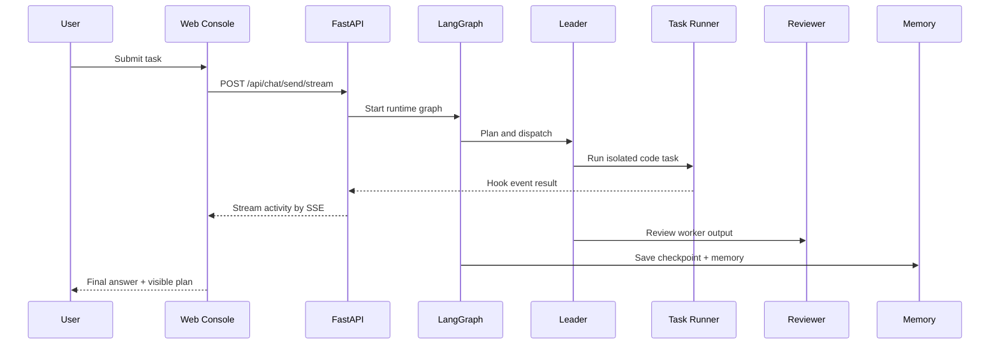
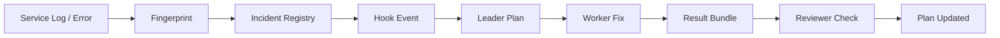

<div align="center">


[](https://git.io/typing-svg)

<p>
  <a href="./README.en.md">English</a>
  ·
  <a href="./README.zh-CN.md">简体中文</a>
</p>

<p>
  
  
  
  
  
  
</p>

<p>
  
  
  
  
  
  
</p>

<h3>把“聊天机器人”升级成会规划、会派工、会修复、会复盘的软件自治系统。</h3>

</div>

---

## 🚀 项目定位

`code-terminator` 是一个面向真实软件工程任务的多智能体运行时。它不是只会回答问题的玩具项目，而是围绕“发现问题 -> 规划任务 -> 派发 Worker -> 回传结果 -> Reviewer 审查 -> 可恢复运行”这条链路搭建的工程系统。

它把 **LangGraph 编排**、**FastAPI 流式服务**、**React 控制台**、**Docker 隔离 Worker**、**长期记忆**、**事件唤醒** 和 **GitHub 自动化协作** 串在一起，让 AI Agent 更像一个可以接入研发流程的自动化队友。

---

## ✨ 核心能力

| 模块 | 能力 | 工程价值 |
| --- | --- | --- |
| 🧠 Leader Agent | 拆解任务、维护计划、调度工具 | 从单轮问答升级为可推进的任务状态机 |
| 🛠️ Worker Agent | 执行具体代码任务 | 将复杂需求拆给独立执行单元处理 |
| 🛡️ Reviewer Agent | 反馈、审查、守住质量 | 让多智能体形成闭环，而不是盲目生成 |
| 🌊 SSE Streaming | Web 端实时流式输出 | 用户能看到任务推进过程、事件和计划变化 |
| 🧩 Plan State Machine | 计划项 pending / running / done | 支持可观测、可恢复、可追踪的任务运行 |
| 🐳 隔离执行环境 | 容器化执行任务 | 隔离执行真实仓库任务，减少污染本地环境 |
| 🧬 Memory + Checkpoint | SQLite checkpoint + Chroma memory | 支持断点恢复、长期上下文和历史复用 |
| 🔔 Incident Wakeup | 事故事件触发自动修复链路 | 从日志/异常到自动派工修复，接近线上运维场景 |
| 🔀 GitHub Flow | Token 注入、PR fallback、自动化协作 | 连接真实研发协作流程 |
| ⚙️ Runtime Settings | UI/API 持久化运行时配置 | 可动态保存运行参数，不必每次重启重配 |

---

## 🌌 核心能力全景

<table>
  <tr>
    <td width="50%">
      <h3>🧠 Agentic Runtime</h3>
      <p>Leader 负责理解目标、拆解任务、维护计划、调用工具和吸收事件；Worker 负责执行任务；Reviewer 负责审查输出。整个运行时不是简单 prompt chaining，而是一个可恢复的图式状态系统。</p>
    </td>
    <td width="50%">
      <h3>🌊 Observable Workflow</h3>
      <p>FastAPI + SSE 将对话、计划、事件、日志和结果流式推到 Web 控制台。每次任务推进都有状态可见，适合接入研发控制台、任务看板或自动化平台。</p>
    </td>
  </tr>
  <tr>
    <td width="50%">
      <h3>🐳 Isolated Execution</h3>
      <p>Worker 任务会被打包成 job bundle，并可在 Docker 中执行。输入、输出、stdout、stderr、结构化结果都会落盘，方便审计、复现和问题定位。</p>
    </td>
    <td width="50%">
      <h3>🔥 Incident-Driven Repair</h3>
      <p>系统支持 incident_new / incident_regressed 事件。异常进入 hook bus 后，Leader 可以生成修复计划并派发 Worker，让系统具备事件驱动的自动修复雏形。</p>
    </td>
  </tr>
  <tr>
    <td width="50%">
      <h3>🧬 Memory & Resume</h3>
      <p>SQLite checkpoint 保存运行状态，Chroma 承载长期记忆，runtime-state 保存会话、计划和设置。长任务可以中断后恢复，不必从零开始。</p>
    </td>
    <td width="50%">
      <h3>🔀 GitHub-Native Automation</h3>
      <p>运行时可保存 GitHub Token，并注入到 Worker 的 GITHUB_TOKEN / GH_TOKEN。后续可以连接分支、提交、PR、审查和自动合并等真实协作链路。</p>
    </td>
  </tr>
</table>

---

## 🏗️ 系统架构



---

## 🧪 运行流程

> 打开 Web 控制台，输入一个工程任务；Leader 生成计划，Worker 被派发到 Docker 中执行，过程通过 SSE 实时显示，任务状态落盘，结果回传后 Reviewer 进行审查；如果系统收到 incident 事件，还能自动唤醒修复链路。



---

## 🧰 技术栈

| Layer | Stack |
| --- | --- |
| Agent Runtime | LangGraph, LangChain, OpenAI-compatible APIs |
| Backend | FastAPI, Pydantic, Uvicorn, SSE |
| Frontend | React, Vite, TypeScript |
| Worker | Docker, Codex-compatible CLI worker, isolated job bundle |
| Memory | SQLite checkpoint, Chroma long-term memory |
| Automation | GitHub token injection, hook event bus, runtime settings |
| Quality | pytest, black, isort, mypy |

---

## 🧱 运行时组件

### Leader

Leader 是系统的调度核心，主要负责：

- 将用户目标转成可执行计划
- 维护 `PlanItem` 状态
- 读取 conversation turns 和 conversation summary
- 调用工具注册表里的工具
- 根据 hook event 更新任务状态
- 针对 incident 事件生成修复任务
- 将 Worker / Reviewer 的输出合并成最终结果

### Worker

Worker 面向具体执行任务，可以处理：

- 代码修改任务
- 文件分析任务
- 测试修复任务
- 回归验证任务
- 目标仓库内的局部实现

当启用 Docker Worker 时，任务会被写入 `.code-terminator/worker-jobs/`，并在隔离容器里执行。

### Reviewer

Reviewer 负责从工程质量角度检查结果，包括：

- 是否满足原始目标
- 是否有明显回归风险
- 是否缺少验证
- 是否需要继续派发任务
- 是否可以生成最终回复

### Hook Bus

Hook bus 是后端和异步 Worker 之间的事件桥。它通过磁盘目录传递事件，避免长任务和 API 请求强绑定。

典型事件：

| Event | 说明 |
| --- | --- |
| `subagent_result` | Worker / Reviewer 返回结果 |
| `incident_new` | 新异常被发现 |
| `incident_regressed` | 已修复问题再次出现 |

### Runtime Service

FastAPI Runtime Service 封装了：

- 会话创建
- 流式对话
- 历史读取
- 计划快照读取
- runtime settings 持久化
- hook event pump
- agent status 查询

---

## ⚡ 快速启动

### 1. 准备环境

需要：

- Python `3.11+`
- `uv`
- Node.js + npm
- Docker

### 2. 安装依赖

```bash
uv sync
npm install
npm --prefix web install
```

### 3. 配置模型访问

```bash
export OPENAI_API_KEY="your-api-key"
export OPENAI_BASE_URL="https://your-openai-compatible-endpoint"
export DEFAULT_MODEL="gpt-4o-mini"
export EMBEDDING_MODEL="text-embedding-3-small"
```

### 4. 启动全栈开发环境

```bash
npm run dev
```

默认地址：

| 服务 | 地址 |
| --- | --- |
| Web Console | `http://127.0.0.1:5174` |
| FastAPI | `http://127.0.0.1:18000` |
| Swagger UI | `http://127.0.0.1:18000/docs` |

---

## 🖥️ 运行方式

### CLI 模式

```bash
uv run python -m src.main --task "Build a TODO app backend"
```

带线程 ID，方便后续恢复：

```bash
uv run python -m src.main \
  --task "Build a TODO app backend" \
  --thread-id demo-001
```

恢复一次历史运行：

```bash
uv run python -m src.main \
  --task "resume" \
  --thread-id demo-001 \
  --resume
```

### API 模式

```bash
uv run uvicorn src.api.app:app --reload --host 127.0.0.1 --port 18000
```

常用接口：

| Endpoint | 说明 |
| --- | --- |
| `GET /api/health` | 健康检查 |
| `GET /api/agents/status` | Agent 状态 |
| `POST /api/chat/send` | 普通对话任务 |
| `POST /api/chat/send/stream` | SSE 流式任务 |
| `GET /api/chat/history` | 历史记录 |
| `GET /api/conversations/{conversation_id}` | 会话详情 |
| `GET /api/conversations/{conversation_id}/plan` | 计划快照 |
| `GET /api/settings/runtime` | 读取运行时配置 |
| `PUT /api/settings/runtime` | 保存运行时配置 |

---

## 🎛️ Web Console

Web 控制台不仅是一个聊天框，它更像一个轻量的 Agent 运行面板：

- 左侧可以维护会话列表
- 中间展示流式对话结果
- 右侧展示计划项和任务状态
- Activity Log 记录运行事件
- Settings 可以保存 GitHub Token
- 后端通过 SSE 推送任务进度
- 页面刷新后仍可读取历史会话和计划快照

推荐本地开发时直接运行：

```bash
npm run dev
```

`web/vite.config.ts` 会将 `/api` 代理到后端端口，默认后端端口是 `18000`。

---

## 🐳 隔离执行环境

如果要让 Leader 把任务派发给容器里的执行环境：

```bash
docker build -t code-terminator/worker-codex -f docker/worker-codex/Dockerfile .
export CODEX_WORKER_DOCKER_IMAGE="code-terminator/worker-codex"
```

执行环境会为每个任务生成 job bundle：

```text
.code-terminator/
  worker-jobs/
    <job-id>/
      leader-task.md
      leader-task.json
      stdout.log
      stderr.log
      result.json
```

这个设计的好处是：每一次 Agent 执行都有可追踪证据，方便审计、复盘、回放和定位失败原因。

### 关键配置

| 变量 | 默认值 | 说明 |
| --- | --- | --- |
| `CODEX_WORKER_DOCKER_IMAGE` | `mcr.microsoft.com/playwright:v1.58.2-noble` | 执行环境镜像 |
| `CODEX_WORKER_TIMEOUT_SECONDS` | `1800` | 单次任务超时 |
| `CODEX_WORKER_CONTAINER_WORKDIR` | `/workspace` | 容器内工作目录 |
| `CODEX_WORKER_CODEX_BIN` | `codex` | 容器内执行命令 |
| `CODEX_WORKER_MODEL` | 空 | 指定执行任务使用的模型 |
| `CODEX_WORKER_JOB_ROOT` | `.code-terminator/worker-jobs` | Worker job bundle 根目录 |
| `CODEX_WORKER_DOCKER_ARGS` | 空 | 额外传给 `docker run` 的参数 |

### Kimi / OpenAI-Compatible Worker

项目也保留了 Kimi 本地集成相关配置，适合验证 OpenAI-compatible endpoint、容器执行和 hook 回传链路：

```text
configs/kimi-local-integration.env.example
configs/kimi-local-integration.dashscope.env.example
docs/kimi-local-integration.md
docs/kimi-local-integration-checklist.md
docs/kimi-local-integration-troubleshooting.md
```

运行脚本：

```bash
uv run --python python3.12 python scripts/run_kimi_local_integration.py
```

---

## 🔥 Incident Auto Dispatch

项目内置了 incident / regression 事件链路。系统收到异常事件后，可以：

1. 生成 incident fingerprint
2. 判断是新问题还是回归问题
3. 创建或更新计划项
4. 自动派发 Worker 修复
5. 通过 hook 事件回传结果
6. 让 Leader / Reviewer 继续处理

这让项目从“被动问答”变成“事件驱动的软件修复系统”。

### Incident Payload 关注字段

| 字段 | 说明 |
| --- | --- |
| `fingerprint` | 异常指纹，用于去重和识别回归 |
| `service` | 出问题的服务名 |
| `exception_type` | 异常类型 |
| `traceback` | 完整堆栈 |
| `trace_id` | 请求链路追踪 ID |
| `path` | 请求路径 |
| `method` | 请求方法 |
| `error_message` | 错误信息 |
| `occurrence_count` | 出现次数 |

### Incident 修复闭环



---

## 🧠 Memory & Recovery

```text
.memory/
  checkpoints.sqlite
  chroma/

.code-terminator/
  runtime-state/
    conversations/
    plans/
    settings/runtime.json
  hook-events/
    pending/
    processing/
  worker-jobs/
```

支持能力：

- 会话历史持久化
- 计划快照持久化
- checkpoint 恢复
- hook event 落盘
- GitHub token 等运行时配置保存
- Chroma 长期记忆

---

## ⚙️ 配置速查

### Core Runtime

| 变量 | 默认值 | 说明 |
| --- | --- | --- |
| `OPENAI_API_KEY` | 空 | LLM / embedding 使用的 API Key |
| `OPENAI_BASE_URL` | 空 | OpenAI-compatible endpoint |
| `DEFAULT_MODEL` | `gpt-4o-mini` | 默认对话模型 |
| `EMBEDDING_MODEL` | `text-embedding-3-small` | 长期记忆 embedding 模型 |
| `MEMORY_DATA_DIR` | `.memory` | memory 根目录 |
| `CHECKPOINT_DB_NAME` | `checkpoints.sqlite` | checkpoint SQLite 文件名 |
| `CHROMA_DIR_NAME` | `chroma` | Chroma 子目录名 |

### API / Runtime State

| 变量 | 默认值 | 说明 |
| --- | --- | --- |
| `CODE_TERMINATOR_API_STATE_ROOT` | `.code-terminator/runtime-state` | API 运行时状态根目录 |
| `CODE_TERMINATOR_HOOK_ROOT` | `.code-terminator/hook-events` | hook 事件目录 |
| `CODE_TERMINATOR_HOOK_STALE_SECONDS` | `30` | processing 事件回收阈值，最小 5 秒 |

### Leader Tuning

| 变量 | 默认值 | 说明 |
| --- | --- | --- |
| `LEADER_MAX_STEPS` | `8` | Leader 最大决策步数 |
| `LEADER_TRACE_STEPS` | `24` | React trace 保留步数 |
| `LEADER_ACTIVITY_LOG_LIMIT` | `60` | 活动日志最大保留条数 |
| `LEADER_LLM_TIMEOUT_SECONDS` | `120` | Leader 模型调用超时 |

### Logging

| 变量 | 默认值 | 说明 |
| --- | --- | --- |
| `APP_LOG_LEVEL` | `INFO` | 日志等级 |
| `APP_LOG_FILE` | `1` | 是否写入文件日志 |

日志默认写入：

```text
artifacts/logs/<run_tag>.log
```

---

## 🧭 适用场景

| 场景 | 可以怎么用 |
| --- | --- |
| 自动代码任务拆解 | 将一个大需求拆成多个 PlanItem，并逐步推进 |
| 仓库级修复 | Worker 在隔离环境中分析、修改和验证目标仓库 |
| 事故自动响应 | 接入日志事件，触发 incident_new / incident_regressed |
| 研发控制台 | 用 Web UI 查看会话、计划、日志和运行状态 |
| 长任务恢复 | 使用 thread_id 和 checkpoint 让任务断点续跑 |
| 自动审查 | Reviewer 检查 Worker 输出并决定是否继续修正 |
| GitHub 自动协作 | 将 Worker 的结果连接到分支、提交和 PR 流程 |

---

## 🧪 Demo 仓库

本项目配套的目标业务仓库：

```text
https://github.com/KKK985429/ecommerce-platform-demo.git
```

该仓库用于承载可复现的业务服务、预置问题、测试用例和修复验证脚本。`code-terminator` 负责运行时编排、任务派发和结果观察，Demo 仓库负责提供可被修复和验证的目标项目。

---

## 📦 项目结构

```text
src/
  agents/              # leader / worker / reviewer
  api/                 # FastAPI routes, models, runtime service
  app/                 # graph, state, hook bus, incident, gitops, plan state machine
  datagov/             # bootstrap package
  memory/              # checkpoint + long-term memory
  observability/       # logging helpers
  prompts/             # role templates
  skills/              # role-scoped skills
  tools/               # tool registry + worker dispatch tools
web/                   # React + Vite console
docker/worker-codex/   # Worker Dockerfile
configs/               # OpenAI-compatible / Kimi integration examples
scripts/               # dev / smoke / worker / regression scripts
docs/                  # API / logging / smoke evidence
ecommerce-platform/    # local demo target, replace with external demo repo later
```

### 关键文件

| 文件 | 说明 |
| --- | --- |
| `src/app/graph.py` | LangGraph runtime 主图 |
| `src/agents/leader.py` | Leader Agent |
| `src/tools/call_code_worker_tool.py` | Worker 派发工具 |
| `src/api/services/runtime_service.py` | API runtime service |
| `src/app/hook_bus.py` | hook event bus |
| `src/app/incidents.py` | incident 处理入口 |
| `src/app/auto_review_merge.py` | 自动 review / merge 相关逻辑 |
| `web/src/App.tsx` | Web 控制台主界面 |

---

## ✅ 验证命令

基础 smoke：

```bash
uv run pytest
```

更完整的测试：

```bash
uv run pytest tests/
```

格式与类型检查：

```bash
uv run black --check src/datagov tests/bootstrap
uv run isort --check-only src/datagov tests/bootstrap
uv run mypy --strict src
```

重点链路测试：

```bash
uv run pytest \
  tests/test_api_integration.py \
  tests/test_hook_pump.py \
  tests/test_worker_runtime_config.py \
  tests/test_incident_auto_dispatch.py \
  tests/test_auto_review_merge.py
```

---

## 📚 相关文档

- [API Reference](./docs/api.md)
- [Logging Guide](./docs/logging.md)
- [Auto Review Server Checklist](./docs/auto-review-server-checklist.md)
- [Kimi Local Integration](./docs/kimi-local-integration.md)
- [Environment Status](./ENV_STATUS.md)

---

<div align="center">


<b>Code Terminator</b> · Agentic software engineering runtime for real repositories.

</div>
