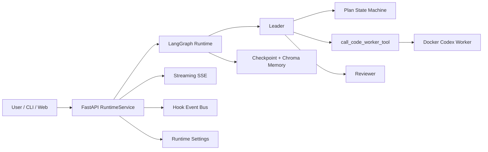

# code-terminator

[](#)
[](#)
[](#)
[](#)
[](#)
[](#)

Language / 语言: [English](./README.en.md) | [简体中文](./README.zh-CN.md)

> 一个不只会聊天的多智能体运行时骨架。
> 现在它已经具备了 CLI、FastAPI、SSE 流式前端、可恢复计划状态、Docker 中的真实 Codex Worker、以及本地持久化运行时设置。

## Overview

`code-terminator` 是一个基于 LangGraph 的多智能体实验场，当前重点已经不再只是“最小骨架”，而是围绕下面这条真实链路打通：

- `leader` 负责规划、拆解任务、维护计划项和 React trace
- `worker` / `reviewer` 负责并发执行与反馈
- Web 控制台通过 FastAPI + SSE 实时展示对话、计划和活动日志
- Docker Worker 可以在隔离工作区里调用 Codex 处理真实仓库任务
- Memory、hook event、runtime settings 都会落盘，支持恢复和追踪



## What's New

相比早期版本，仓库里现在已经新增了这些值得写进 README 的内容：

- Web 控制台：React + Vite，支持会话列表、流式回复、计划面板、活动日志、GitHub Token 设置
- FastAPI Runtime：支持 `/api/chat/send`、`/api/chat/send/stream`、历史记录、计划快照、运行时设置
- Hook 持久化总线：后台线程可通过磁盘事件把子代理结果安全回传给 API runtime
- Docker Worker 执行链路：Leader 可以把任务打包成 job bundle，在独立容器中执行 Codex
- 运行时设置持久化：支持从 UI/API 保存 `github_token`，Worker 会自动注入到 `GITHUB_TOKEN` / `GH_TOKEN`
- 可恢复运行时：支持 `thread_id`、checkpoint 恢复、事件注入
- Python bootstrap：`uv` 管理依赖，`src/datagov/` 作为独立可导入包保留
- 环境烟雾验证：`ENV_STATUS.md` 和 `docs/smoke/` 记录了环境检查结果
- 附带参考目录：`cliagent/`、`opms-collab/` 作为实验/集成目录已纳入仓库

## Quick Start

### 1. 准备环境

- Python `3.11+`
- `uv`
- Node.js + npm
- Docker

### 2. 安装依赖

```bash
uv sync
npm install
npm --prefix web install
```

### 3. 配置模型访问

推荐先准备一个 `.env`，至少补齐 LLM 和 embedding 所需变量：

```bash
export OPENAI_API_KEY="your-api-key"
export OPENAI_BASE_URL="https://your-openai-compatible-endpoint"
export DEFAULT_MODEL="gpt-4o-mini"
export EMBEDDING_MODEL="text-embedding-3-small"
```

如果你只跑本地 UI 壳子、不触发真实模型调用，这些变量可以稍后再配。

## Run Modes

### CLI

```bash
uv run python -m src.main --task "Build a TODO app backend"
```

带线程与恢复：

```bash
uv run python -m src.main \
  --task "Build a TODO app backend" \
  --thread-id demo-001

uv run python -m src.main \
  --task "resume" \
  --thread-id demo-001 \
  --resume
```

注入子代理结果事件：

```bash
uv run python -m src.main \
  --task "resume" \
  --thread-id demo-001 \
  --resume \
  --event-type subagent_result \
  --event-task-id task-abc \
  --event-status completed \
  --event-role worker \
  --event-details "implementation finished"
```

### API

```bash
uv run uvicorn src.api.app:app --reload --host 127.0.0.1 --port 18000
```

启动后可访问：

- API: `http://127.0.0.1:18000/api`
- Swagger UI: `http://127.0.0.1:18000/docs`

### Full Stack Dev

```bash
npm run dev
```

这个命令会同时启动：

- 前端 Vite：`http://127.0.0.1:5174`
- 后端 FastAPI：`http://127.0.0.1:18000`

`web/vite.config.ts` 会把 `/api` 代理到 `BACKEND_PORT`，默认就是 `18000`。

## Real Docker Worker

如果你希望 `leader` 真正把任务发给 Docker 中的 Codex Worker，建议先准备一个稳定的 Worker 镜像：

```bash
docker build -t code-terminator/worker-codex -f docker/worker-codex/Dockerfile .
export CODEX_WORKER_DOCKER_IMAGE="code-terminator/worker-codex"
```

如果你没有系统级 Docker daemon，也可以在工作区里启动独立 daemon：

```bash
./scripts/start_workspace_docker.sh
export DOCKER_HOST="unix://$PWD/.docker/docker.sock"
```

Worker 执行时会：

1. 在 `.code-terminator/worker-jobs/` 下生成任务 bundle
2. 写入 `leader-task.md` 和 `leader-task.json`
3. 启动 Docker 容器
4. 把结果、stdout、stderr、内部日志都落盘

### Kimi 本地集成用例

仓库现在附带了一个真实的本地 Kimi Docker 集成用例，专门验证：

- `call_code_worker` 的真实异步链路
- Docker 内部能正常拉起 Kimi
- Worker 只在隔离工作区里写本地文件
- hook 回传的 `structured_output` 可以被主流程正确解析
- 全程不触发 GitHub 或远端仓库操作

配置样例：

```bash
configs/kimi-local-integration.env.example
```

手动运行：

```bash
uv run --python python3.12 python scripts/run_kimi_local_integration.py
```

如果你希望显式指定 API 参数：

```bash
set -a
source configs/kimi-local-integration.env.example
export OPENAI_BASE_URL="https://your-openai-compatible-endpoint"
export OPENAI_API_KEY="your-api-key"
set +a

uv run --python python3.12 python scripts/run_kimi_local_integration.py
```

如果你要把它作为真实 pytest 用例运行，需要显式开启：

```bash
RUN_KIMI_LOCAL_INTEGRATION=1 \
OPENAI_BASE_URL="https://your-openai-compatible-endpoint" \
OPENAI_API_KEY="your-api-key" \
uv run --python python3.12 pytest -q tests/test_kimi_local_integration.py
```

详细说明见：

```text
docs/kimi-local-integration.md
```

辅助文件：

```text
docs/kimi-local-integration-checklist.md
docs/kimi-local-integration-troubleshooting.md
scripts/run_kimi_local_integration.sh
configs/kimi-local-integration.dashscope.env.example
```

## Configuration

### Core Runtime

| 变量 | 默认值 | 说明 |
| --- | --- | --- |
| `OPENAI_API_KEY` | 空 | LLM / embedding 使用的 API Key |
| `OPENAI_BASE_URL` | 空 | OpenAI 兼容接口地址 |
| `DEFAULT_MODEL` | `gpt-4o-mini` | 默认对话模型 |
| `EMBEDDING_MODEL` | `text-embedding-3-small` | 长期记忆 embedding 模型 |
| `MEMORY_DATA_DIR` | `.memory` | memory 根目录 |
| `CHECKPOINT_DB_NAME` | `checkpoints.sqlite` | checkpoint SQLite 文件名 |
| `CHROMA_DIR_NAME` | `chroma` | Chroma 子目录名 |

### API / Runtime State

| 变量 | 默认值 | 说明 |
| --- | --- | --- |
| `CODE_TERMINATOR_API_STATE_ROOT` | `.code-terminator/runtime-state` | API 运行时状态根目录 |
| `CODE_TERMINATOR_HOOK_ROOT` | `.code-terminator/hook-events` | hook 事件目录 |
| `CODE_TERMINATOR_HOOK_STALE_SECONDS` | `30` | processing 事件回收阈值，最小 5 秒 |

运行时设置文件默认位置：

```text
.code-terminator/runtime-state/settings/runtime.json
```

当前持久化字段只有一个：

- `github_token`

它可以从 Web UI 或 `PUT /api/settings/runtime` 写入，随后会自动注入 Worker 的 `GITHUB_TOKEN` / `GH_TOKEN`。

### Leader Tuning

| 变量 | 默认值 | 说明 |
| --- | --- | --- |
| `LEADER_MAX_STEPS` | `8` | Leader 最大决策步数 |
| `LEADER_TRACE_STEPS` | `24` | React trace 保留步数 |
| `LEADER_ACTIVITY_LOG_LIMIT` | `60` | 活动日志最大保留条数 |
| `LEADER_LLM_TIMEOUT_SECONDS` | `120` | Leader 模型调用超时 |

### Worker Runtime

常用配置：

| 变量 | 默认值 | 说明 |
| --- | --- | --- |
| `CODEX_WORKER_DOCKER_IMAGE` | `mcr.microsoft.com/playwright:v1.58.2-noble` | Worker 镜像 |
| `CODEX_WORKER_TIMEOUT_SECONDS` | `1800` | 单次 Worker 超时 |
| `CODEX_WORKER_CONTAINER_WORKDIR` | `/workspace` | 容器内工作目录 |
| `CODEX_WORKER_CODEX_BIN` | `codex` | 容器内 Codex 命令 |
| `CODEX_WORKER_MODEL` | 空 | 指定 Worker 使用的模型 |
| `CODEX_WORKER_JOB_ROOT` | `.code-terminator/worker-jobs` | Worker job bundle 根目录 |
| `CODEX_WORKER_HOST_NODE_ROOT` | 自动探测 | 挂载宿主机 Node/Codex 根目录 |
| `CODEX_WORKER_CONTAINER_NODE_ROOT` | `/opt/host-node` | 容器内挂载 Node 根目录 |
| `CODEX_WORKER_DOCKER_ARGS` | 空 | 额外透传给 `docker run` 的参数 |

代理与网络相关的高级项：

- `CODEX_WORKER_PASSTHROUGH_PROXY`
- `CODEX_WORKER_GIT_PROXY`
- `CODEX_WORKER_GIT_HTTP_PROXY`
- `CODEX_WORKER_GIT_HTTPS_PROXY`
- `CODEX_WORKER_TOOL_PROXY`
- `CODEX_WORKER_TOOL_HTTP_PROXY`
- `CODEX_WORKER_TOOL_HTTPS_PROXY`
- `CODEX_WORKER_TOOL_ALL_PROXY`
- `CODEX_WORKER_TOOL_NO_PROXY`

当前实现会把 Git 代理和通用工具代理分开处理；若代理指向 `127.0.0.1` / `localhost`，Linux 下会自动切到 `--network host` 或改写为 `host.docker.internal`。

### Logging

| 变量 | 默认值 | 说明 |
| --- | --- | --- |
| `APP_LOG_LEVEL` | `INFO` | 日志等级 |
| `APP_LOG_FILE` | `1` | 是否写入文件日志 |

日志文件默认写到：

```text
artifacts/logs/<run_tag>.log
```

## Web Console

当前前端不只是一个聊天框，还包括：

- 会话列表和历史恢复
- SSE 流式消息展示
- 计划项面板
- Activity Log 面板
- GitHub Token 保存和本地持久化

相关接口：

- `GET /api/health`
- `GET /api/agents/status`
- `POST /api/chat/send`
- `POST /api/chat/send/stream`
- `GET /api/chat/history`
- `GET /api/conversations/{conversation_id}`
- `GET /api/conversations/{conversation_id}/plan`
- `GET /api/settings/runtime`
- `PUT /api/settings/runtime`

## Useful Scripts

```bash
# OpenAI 兼容接口连通性检查
uv run python scripts/check_connectivity.py

# 调用 Anthropic 兼容接口
uv run python scripts/call_anthropic_api.py

# 20 条真实任务顺序回归
uv run python scripts/run_20_queries_real.py --run-tag local-real

# 20 条任务并发回归
uv run python scripts/run_20_queries_concurrent.py --run-tag local-fast
```

## Verification

基础安装与 bootstrap smoke：

```bash
uv run black --check src/datagov tests/bootstrap
uv run isort --check-only src/datagov tests/bootstrap
uv run mypy --strict src
uv run pytest
```

如果你要显式跑当前主项目测试，而不只依赖 `pyproject.toml` 里的默认 smoke 范围，建议直接指定路径：

```bash
uv run pytest tests/
```

针对新增运行时能力，优先关注这些测试：

```bash
uv run pytest \
  tests/test_api_integration.py \
  tests/test_hook_pump.py \
  tests/test_main_runtime.py \
  tests/test_worker_runtime_config.py \
  tests/test_list_plan_tool.py
```

## Project Layout

```text
src/
  agents/              # leader / worker / reviewer
  api/                 # FastAPI routes, models, runtime service
  app/                 # graph, state, hook bus, collaboration, plan state machine
  datagov/             # bootstrap package
  memory/              # checkpoint + long-term memory
  prompts/             # role templates
  skills/              # role-scoped skills
  tools/               # tool registry + worker dispatch tools
web/                   # React + Vite 控制台
docker/worker-codex/   # Worker Dockerfile
scripts/               # dev / smoke / worker / regression scripts
docs/                  # API / logging / smoke evidence
cliagent/              # 额外 CLI agent 相关目录
opms-collab/           # 协作实验目录
```

## Related Docs

- [API Reference](./docs/api.md)
- [Logging Guide](./docs/logging.md)
- [Environment Status](./ENV_STATUS.md)
- [Contributing](./CONTRIBUTING.md)

<details>
<summary>Storage Cheatsheet</summary>

```text
.memory/
  checkpoints.sqlite
  chroma/

.code-terminator/
  runtime-state/
    conversations/
    plans/
    settings/runtime.json
  hook-events/
    pending/
    processing/
  worker-jobs/
```

</details>
